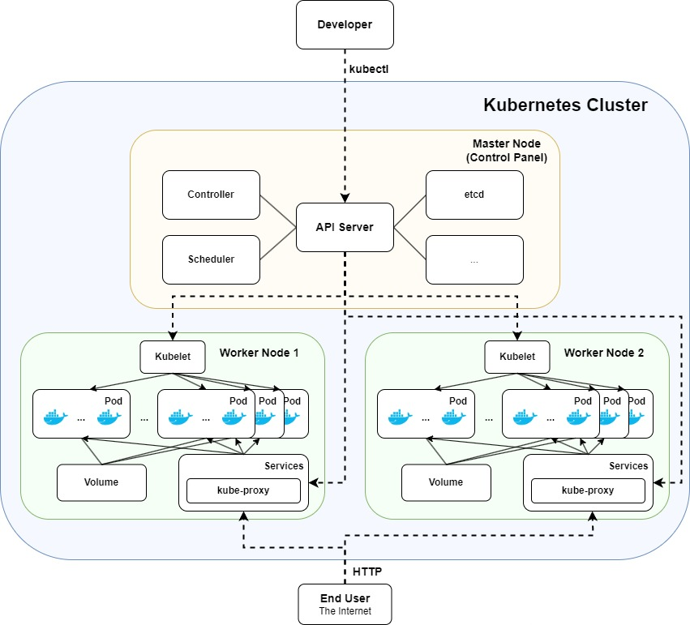

# [Part 3](https://devopswithdocker.com/category/part-3): DevOps with Docker: security and optimization ([TKT21038](https://studies.helsinki.fi/courses/course-implementation/otm-487d8dd8-3a4b-447a-9118-f7bfff8169b6)) 1 ECTS

## Exercise 3.1

- [Config](../.github/workflows/deploy-express-app.yaml) file for the deployment pipeline of the simple Express-App.
- [Docker-compose](Exercise3.1/docker-compose.yml) file that pulls and run the Express-App and Watchtower from Docker Hub.

## Exercise 3.2

- [Config](../.github/workflows/deploy-express-app.yaml) file for the deployment pipeline of the simple Express-App including deployment to Render.

- [Link](https://express-app-hf9n.onrender.com/) to the deployed Express-App on Render (may take 1 min to start)

## Exercise 3.3

- [Shell Script](Exercise3.3/builder.sh) file used.

- Run as desribed in the exercise instructions (must be logged in on Docker Hub)
    ```
    ./builder.sh mluukkai/express_app usename_here/testing
    ```


## Exercise 3.4
Files:
- [Shell Script](Exercise3.4/builder.sh) file used (Login added since it is manually managed in exercise 3.3).
- [Dockerfile](Exercise3.4/Dockerfile) used.

Commands:
- First build the image with `docker build -t builder .`

- Then run as described in the exercise in a single line:
    ```
    docker run -e DOCKER_USER=username_here \
        -e DOCKER_PWD=password_here \
        -v /var/run/docker.sock:/var/run/docker.sock \
        builder mluukkai/express_app username_here/testing
    ```

## Exercise 3.5

- [Dockerfile](Exercise3.5/example-frontend/Dockerfile) used for the frontend.
- [Dockerfile](Exercise3.5/example-backend/Dockerfile) used for the backend.

## Exercise 3.6
- I joined the RUN commands in the dockerfile of the frontend and backend. There was no difference in both at first (in GB) but I also removed `node_modules` which has slightly reduced the size of the frontend image.

    | Image | Before | After | Dockerfile |
    |-------| -------| ------| -- |
    | Frontend | 1.27 GB | 1.08 GB | [Dockerfile](Exercise3.6/example-frontend/Dockerfile) |
    | Backend  | 1.06 GB | 1.06 GB | [Dockerfile](Exercise3.6/example-backend/Dockerfile) |

## Exercise 3.7

- Using an Alpine variants significantly reduced the size of the images:

    | Image | Before | Ex 3.6 | With Alpine |  Dockerfile |
    |-------| -------| ------| -- | -- |
    | Frontend | 1.27 GB | 1.08 GB | 297 MB | [Dockerfile](Exercise3.6/example-frontend/Dockerfile) |
    | Backend  | 1.06 GB | 1.06 GB | 479 MB | [Dockerfile](Exercise3.6/example-backend/Dockerfile) |

## Exercise 3.8
Using a multi-stage build we now have an image size of **82 MB**
- [Dockerfile](Exercise3.8/example-frontend/Dockerfile) used.

## Exercise 3.9
Using a multi-stage build we now have an image size of **19 MB**
- [Dockerfile](Exercise3.9/example-backend/Dockerfile) used

## Exercise 3.10
I use again the [Unicafe](https://fullstackopen.com/en/part1/a_more_complex_state_debugging_react_apps#exercises-1-6-1-14) exercise from the Full Stack Open Part 1. The docker image created in the [exercise 1.15](https://devopswithdocker.com/part-1/section-6#exercises-115-116) of the Part 1 was **1.23 GB**.

- [Dockerfile](../Part1/Exercise1.15/Dockerfile) used in the exercise 1.15.

Using a multi-stage build we now have an image size of **81.6 MB** !

- [Dockerfile](Exercise3.10/Dockerfile) used for optimizing security and size.

## Exercise 3.11
Diagram created using [draw.io](draw.io) describing my novice understanding of Kubernetes:
- Applications are executed in Containers in Pods.
- Cluster is deployed in several worker machines (*worker Nodes*) orchestrated by a *Master Node* to ensure availability, redundancy, self-healing, scaling and where workloads are balanced.
- [drawio](Exercise3.11/Ex311_Kubernetes.drawio) file used




